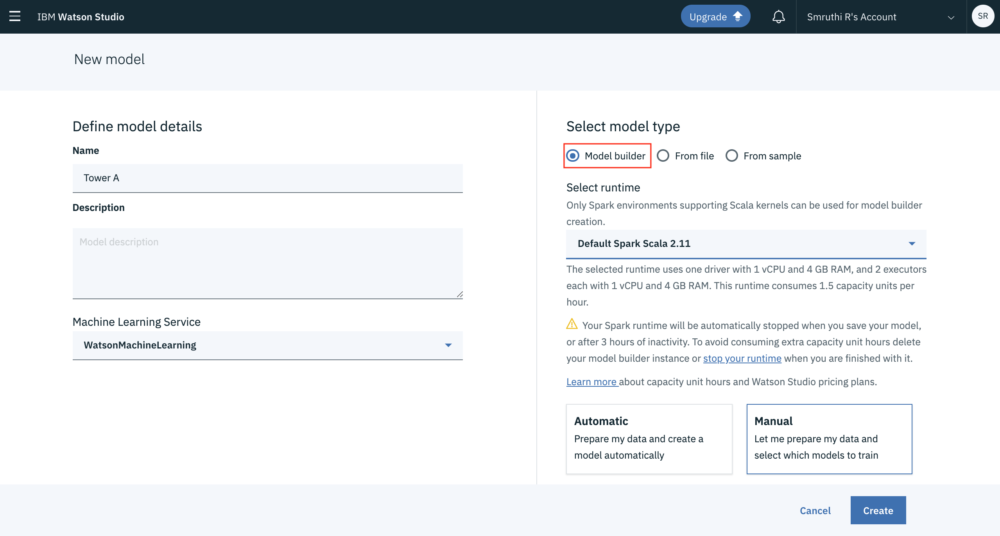

# Monitor your ML Models using Watson OpenScale

## Pre-requisites
* [IBM Cloud Pak for Data]() Or [IBM Cloud Account](https://cloud.ibm.com/)


## Steps
1. [Create a new Watson Studio Project]()
2. [Add a new Watson Machine Learning Model]()
3. [Build your own Machine Learning Model with WML Model Builder]()
4. [Save and Deploy your WML Model]()
5. [Create a new Watson OpenScale instance on IBM Cloud]()
6. [Create a new Watson Studio Python Notebook]()
7. [Configure Credentials in your Notebook]()
8. [Run the Inital Scoring and Payload Logging]()
9. [Configure the Quality and Fairness Monitors on Watson OpenScale]()
10. [Add Feedback Data to setup your dashboard on Watson OpenScale]()


### 1. Create a new Watson Studio Project

* On IBM Cloud create a new [Watson Studio](https://cloud.ibm.com/catalog/services/watson-studio)

  
  
* Make sure to set the location to `Dallas`, select the appropriate plan and hit Create.
* Go to your [IBM Cloud Dashboard](https://cloud.ibm.com/)
* Click on `resources>services` select your Watson Studio Service and click on `Get Started`.
* Create a new Project as shown below-
  
  
  
* If you don't have a Cloud Object Storage Instance then follow the onscreen steps to create a new Cloud Object Storage Instance.

### 2. Add a new Watson Machine Learning Model

* Click on `Add to Project` and select `Watson Machine Learning` option.
* If you already have a WML instance, make sure it is in the `Dallas` region. If not, follow the steps as below-
  

```Note: Ensure your WML region is Dallas```
* Select `model type> model builder`
* Select `runtime> Default Spark Scala 2.11`
* Select the `Manual` option
  
* Give your model a name and hit create.

### 3. Build your own Machine Learning Model with WML Model Builder

* 

